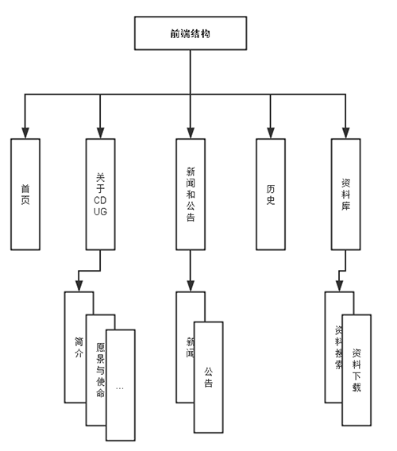
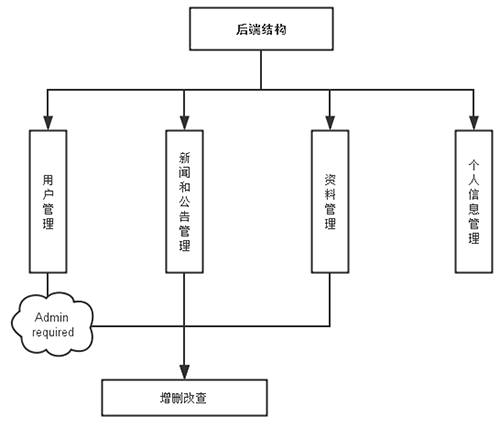
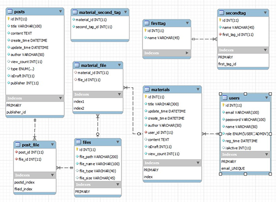
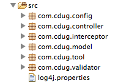
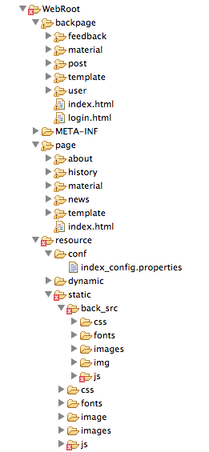

#CDUG网站文档

```
@author: yiliang Guo
@email:  yiliangg@foxmail.com

-update:
	2014-06-04 yiliang  "initial"
```

##1.背景和编写目的

CDUG网站是专为同济大学软件学院主办的回忆CDUG而编写的网站程序，旨在提供CDUG新闻和公告发布、CDUG资料下载、CDUG历史资料查询、CDUG会议介绍等展示性服务，是会议的网络门面。

本文档编写目的如下：

1. 描述CDUG网站的技术架构，便于未来的潜在开发者尽快了解网站的基本结构和技术架构，方便后续开发
2. 描述CDUG网站目前的配置流程，以便在非常情况下，能够对网站进行重新设置和恢复
3. 描述CDUG网站目前存在的一些不足和限制

```本文档采用markdown编写，您可以很方便地对原始文档进行修改。```

##2.CDUG网站架构
###2.1 网站逻辑架构
####前台WEBview模块



* 首页：cdug网站首页
* 关于cdug：cdug简介、愿景与使命、历史、组织架构、参会单位、赞助机构、统计数字、联系我们
* 新闻公告：包括新闻和公告两个子模块
* 历史会议：包含历史会议主页和历史回忆单独页面的链接
* 资料库：资料搜索和资料下载

####后台Background模块



* 用户管理：维护网站用户列表和用户信息，只有管理员可以操作
* 新闻和公告管理：维护网站新闻和公告，普通用户只能维护个人发表过的资源，管理员可以维护所有资源
* 资料管理：维护网站的资料库，普通用户只能维护个人发表过的资源，管理员可以维护所有资源
* 个人信息管理：账号信息和密码修改

####网站权限管理
1. 管理员（admin）：
	
	拥有所有后台数据的管理权限，包括用户管理、新闻公告管理、资料管理。
2. 普通用户（user）：

	只拥有对自己发布的资源的管理权限，包括新闻公告管理、资料管理。


###2.2 网站技术架构
####技术栈
* 开发技术语言：Java、Javascript、HTML、CSS
* 开发使用到的库：
	* [Bootstrap](http://www.bootcss.com/) 前端开发框架
	* [Jquery](http://www.oschina.net/p/jquery) 前短库
	* [Jquery-fileupload](http://www.oschina.net/p/jquery-file-upload) 文件上传库
	* [Jfinal](http://www.jfinal.com/) J2EE快速开发框架
	* [DataTable]() table库
	* [CKEditor](http://ckeditor.com/) 网页端的富文本编辑器
	* [FreeMarker](http://freemarker.org/) JSP模板引擎
* 配置需求：
	* [TOMCAT7.0]() Java服务器 
	* [mysql-lastest]() 数据库服务
	* [Ngnix]() 代理服务器
	
* 操作系统：Centos 6.0+
* 预配置环境：JDK7+,Mysql5.0+

####数据库设计概要
数据库设计可以参考```尤传跃```同学的论文（在附件里），第四章第三节。




（1）	users表
	该表为存储用户信息的表，属性role表示用户的角色有两种，分别为普通用户和管理员；属性isActive表述用户的状态，分别为已激活的和未激活的。表中属性详细说明见下表4-1。


（2）	materials表
	该表为存储用户发表的或以草稿形式保存的技术资料文章的表，users表和materials表的对应关系为一对多，一个用户可以发表多篇技术资料；属性isDraft表示技术资料有两种状态，分别是是已发表的和保存为草稿的。


（3）	posts表
该表为存储用户发表的或以草稿形式保存的新闻或公告的表，users表和posts表的对应关系为一对多，一个用户可以发表多篇新闻或公告；属性isDraft表示新闻或资料有两种状态，分别是是已发表的和保存为草稿的；属性type表示信息有两种类型，分别为新闻和公告。

（4）	files表
该表为存储技术资料或新闻和公告的附件的表，files表通过material_file关系表以及post_file关系表与materials表以及posts表关联起来，一篇技术资料或新闻或公告可以有多个附件。

（5）	firsttag表
该表为存储技术资料类型的第一个标签的表，firsttag表和secondtag表的对应关系是一对多关系。

（6）	secondtag表
该表为存储技术资料类型的第二个标签。

（7）	material_file关系表
该表为material表和file表之间的关系表，负责将两个表关联起来。


（8）	post_file关系表
该表为posts表和file表之间的关系表，负责将两个表关联起来。

（9）	material_second_tag关系表
该表为material表和second_tag表之间的关系表，负责将两个表关联起来。


####网站分层实现逻辑

网站采用Jfinal开发框架开发，Jfinal是国人开发的轻量级的J2EE开发库，融合了诸如AOP、Plugins、ORM等多种开发中常用的特性，使得J2EE开发如Ruby、Python等动态语言开发一样方便。 Jfinal也秉承了**约定大于配置**的思想，所以开发之前最好阅读其[文档](http://www.jfinal.com/man)。

#####网站代码结构



* config:  包括路由表的配置、网站全局参数配置、测试脚本
* controller: 

	前后端结构中各个节点的控制器。```注：含有Management命名的是后端控制器```
* interceptor: 包括了系统controller中用户session控制、权限控制的AOP实现
* model: 数据实体类，操作数据实体
* tool: 一些比较简单的重用小程序，如数据格式处理等
* validator: 验证数据完整性的类


#####主要类功能及代码描述
1. 包interceptor中的类都是通过annotation加入controller中，即在每个方法或者类之前插入的方法，达到了实现切面的目的。代码示例如下：
	
	```
	@Before(LoginInterceptor.class)
	public class MaterialManageController extends Controller { 
	```
	执行这个controller之前需要通过logininterceptor
	
2. 包model中包装了所有数据库的底层操作，使用了Jfinal插入了的数据库ORM - C3p0Plugin.

3. 另外一个比较重要的类是JfinalConfiguration类，该类是整个开发框架配置的核心。

	```
	public void configConstant(Constants me) //一些全局数据的配置
	public void configRoute(Routes me) //路由的配置，这里可以加入多个路由
	public void configPlugin(Plugins me)  //插件配置，可以加入插件，如orm插件C3p0Plugin就是在这里加入
	public void configInterceptor(Interceptors me) //配置aop，全局的aop
	public void configHandler(Handlers me) //配置handler，基本用不到目前
	public static void main(String[] args) //测试服务器配置。
	```
	
4. CKeditor配置代码
	```最简单的默认配置，具体详细定义可以查看ckeditor文档```
	
	```
	var baseUrl = $("#base-url").val();
CKEDITOR.editorConfig = function( config ) {
	// Define changes to default configuration here.
	// For the complete reference:
	// http://docs.ckeditor.com/#!/api/CKEDITOR.config

	// The toolbar groups arrangement, optimized for two toolbar rows.
	config.toolbarGroups = [
		{ name: 'clipboard',   groups: [ 'clipboard', 'undo' ] },
		{ name: 'editing',     groups: [ 'find', 'selection', 'spellchecker' ] },
		{ name: 'links' },
		{ name: 'insert' },
		{ name: 'forms' },
		{ name: 'tools' },
		{ name: 'document',	   groups: [ 'mode', 'document', 'doctools' ] },
		{ name: 'others' },
		'/',
		{ name: 'basicstyles', groups: [ 'basicstyles', 'cleanup' ] },
		{ name: 'paragraph',   groups: [ 'list', 'indent', 'blocks', 'align', 'bidi' ] },
		{ name: 'styles' },
		{ name: 'colors' },
		{ name: 'about' }
	];
		// 换行方式
		 config.enterMode = CKEDITOR.ENTER_BR;
		 // 当输入：shift+Enter是插入的标签
		 config.shiftEnterMode = CKEDITOR.ENTER_BR;// 
		 //图片处理
		 config.pasteFromWordRemoveStyles = true;
		 config.filebrowserImageUploadUrl = baseUrl+"private/pic/picUpload";
		 
		 // 去掉ckeditor“保存”按钮
		 config.removePlugins = 'save';
		
	// Remove some buttons, provided by the standard plugins, which we don't
	// need to have in the Standard(s) toolbar.
	config.removeButtons = 'Underline,Subscript,Superscript';

	// Se the most common block elements.
	config.format_tags = 'p;h1;h2;h3;pre';

	// Make dialogs simpler.
	config.removeDialogTabs = 'image:advanced;link:advanced';
};
	```
	
5. DataTable 配置代码 

	```
	jQuery(function($) {
		$(document).ready(
				function() {
					var Otable = $('#example').dataTable({
						"sPaginationType" : "bs_four_button"
					});
					$('#example').each(
							function() {
								var datatable = $(this);
								// SEARCH - Add the placeholder for Search and Turn this into in-line form control
								var search_input = datatable.closest(
										'.dataTables_wrapper').find(
										'div[id$=_filter] input');
								search_input.attr('placeholder', 'Search');
								search_input.addClass('form-control input-sm');
								// LENGTH - Inline-Form control
								var length_sel = datatable.closest(
										'.dataTables_wrapper').find(
										'div[id$=_length] select');
								length_sel.addClass('form-control input-sm');
							});
					Otable.fnSort( [ [3,'desc'] ] );
				});
	});
	```


#####网站页面代码结构



页面分为两套UI：**前端UI**和**后端UI**

1. 前端UI：
	* 页面文件夹 ———— page文件夹
	* 资源文件夹 ———— /resource/static文件夹
2. 后端UI：
	* 页面文件夹 ———— backpage文件夹
	* 资源文件夹 ———— /resource/static/back_src文件夹
```
页面采用free marker框架编写，可以参考其官方文档
```


##3 网站配置和部署

###配置基本流程

配置基本流程：

1. 备份/WebRoot/resource/dynamic目录
2. 通过eclipse导出项目zh.war包
3. 进入tomcat管理页面
4. 部署zh.war包
5. 部署成功
5. 替换/WebRoot/resource/dynamic目录文件
6. 部署完成

```注意：网站相对目录/WebRoot/resource/dynamic 下的文件如果重新部署会被覆盖掉，需要备份过后再部署war。```


###数据库配置
数据库配置文件在文件系统中：
> /WebRoot/WEB-INF/config.properties

```
jdbcUrl = jdbc:mysql://localhost/cdug_zh? //数据库访问配置characterEncoding=GBK&zeroDateTimeBehavior=convertToNull
user = root        //数据库用户名
password = xxxx  //数据库密码
devMode = true    //是否是开发模式
postsPageSize =10  //网站新闻公告分页limit
baseURL= http://cdug.tongji.edu.cn/zh/   //这是配置网站的根目录配置
```

###服务器配置
Tomcat7.0服务器需要安装，基本没有什么特别的配置，只用配置一下权限，在tomcat-users.xml中：

```
<tomcat-users>
 <role rolename="manager-gui"/>
 <user username="tomcat" password="tongjicdug" roles="manager-gui"/>
</tomcat-users>
```

另外，配置nginx代理，把cdug网站解析指向8080端口,把静态页面解析指向一个可用的目录：

```
server {
    listen 80;
    server_name cdug.tongji.edu.cn;
    location / {
        root   /home/cdug_admin/cdug;
        index  index.html index.htm;
    }
    location /zh {
        proxy_set_header   X-Real-IP $remote_addr;
        proxy_set_header   Host      $http_host;
        proxy_pass         http://0.0.0.0:8080/zh;
    }
}
```


###网站首页配置

网站首页配置文件在：

```/WebRoot/resource/conf/index_config.properties```

具体内容如下：

```
{ "sliders":
	[
 	{"title":"2013年度大中华区主机开发者上海论坛举行...","url":"news/content/42","image":"resource/static/image/index1.png"},
 	{"title":"2012大中华区主机开发者与用户年会成功举行...","url":"news/content/34","image":"resource/static/image/2012index.png"},
 	{"title":"2011大中华区大型主机应用与开发用户大会开幕...","url":"news/content/33","image":"resource/static/image/2011index.png"}
 	]
 	,
   "notice":{
   		"image":"off",
   		"path":"resource/static/image/notice/notice1.png",
   		"url1":"",
   		"url2":""
   }
 }
```

**sliders** 可以配置首页轮播图片的相关信息。

**notice** 是方便在会议开始后切换会议宣传栏。


##4. 网站不足和缺陷列表

1. 网站目前对IE的兼容性只到达IE9及更新版本，无法兼容IE8及以下版本
2. 资料库中得资料分类只能手动在数据库设置添加删除，包括一级分类和二级分类
3. 网站未启用JFinal缓存机制，如果未来有必要，可以考虑设置缓存
